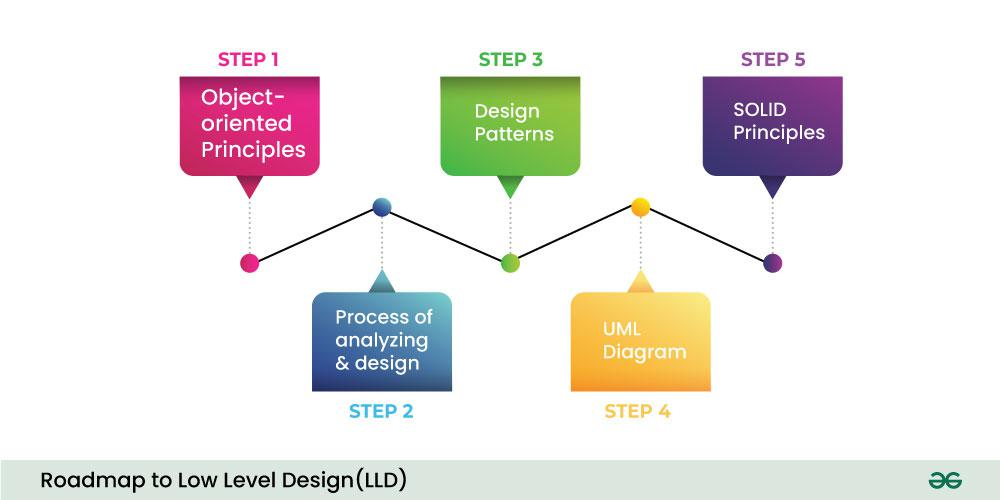
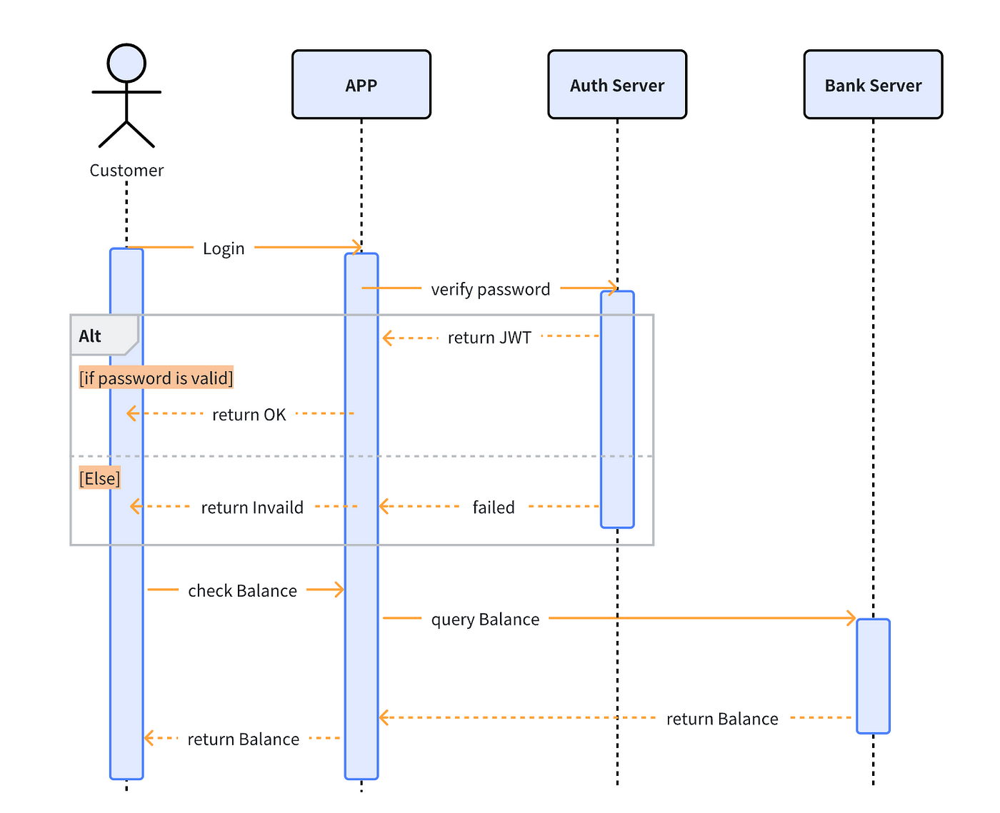
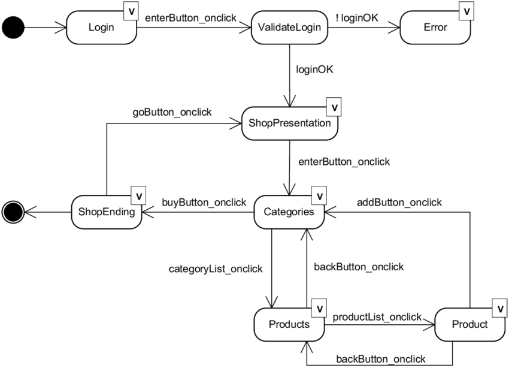
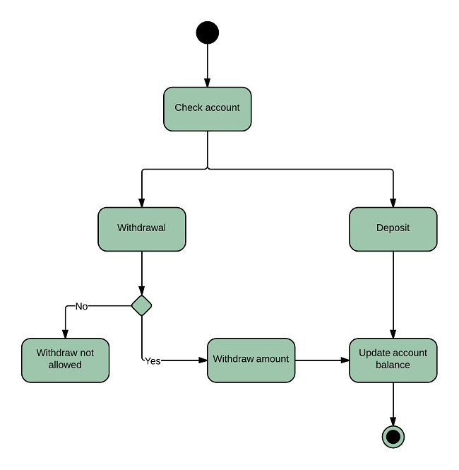
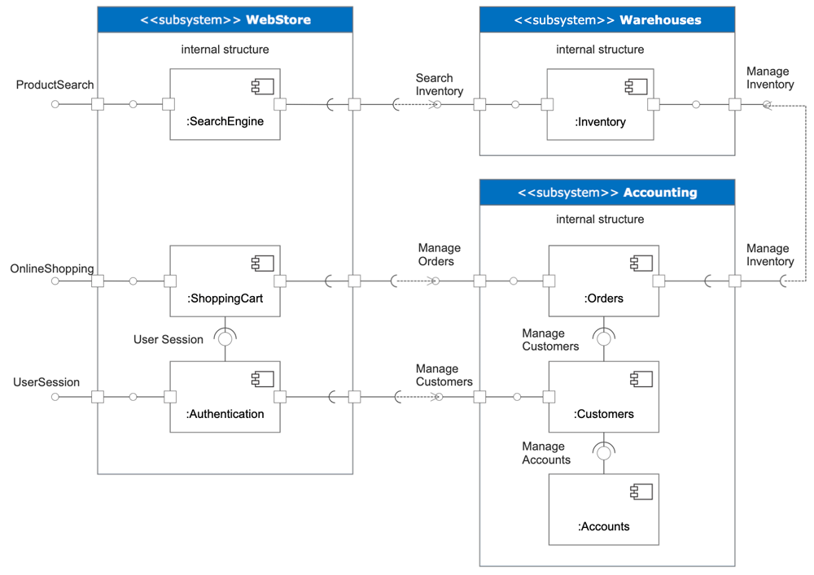
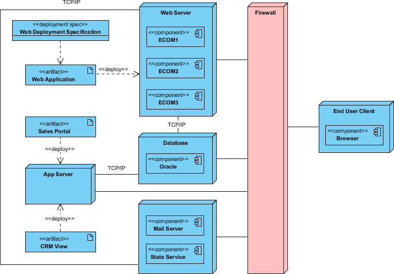

# Low Level Design (LLD)
LLD is Important for the following reasons:
- It helps in understanding the internal working of the system.
- It helps in understanding the flow of data within the system.
- It helps in understanding the flow of control within the system.
- It helps in understanding the interaction between the system and the database.

## 1. Introduction
- Low Level Design (LLD) is the process of converting the High Level Design (HLD) into a detailed design that can be used for coding.
- The main aim of Low Level Design (LLD) is to describe the modules, classes, functions, data structures, etc., in detail.
- The Low Level Design (LLD) document is used by the developers to start coding the software components.

## 2. Object Oriented Design Principles
- Object Oriented Design Principles are the core concepts of Object Oriented Programming (OOP) languages.
- They are the foundation of Object Oriented Programming (OOP).
- They are the set of rules that are used to design the software in an object-oriented way.

## 3. Process of Analysis and Design
- The process of Analysis and Design is a series of steps that are followed by the software developers to design the software.
- The process of Analysis and Design is also known as the Software Development Life Cycle (SDLC).
- The process of Analysis and Design consists of the following steps:
  - Requirement Analysis
  - System Analysis
  - System Design
  - Coding
  - Testing
  - Maintenance

## 4. Design Patterns
- Design Patterns are the best practices that are used by the software developers to design the software.
- Design Patterns are the reusable solutions to the common problems that are faced by the software developers.
- Design Patterns are the general solutions that are used to design the software.

## 5. UML Diagrams
- UML stands for Unified Modeling Language.
- UML is a standard language for specifying, visualizing, constructing, and documenting the artifacts of software systems.
- UML was created by the Object Management Group (OMG) and UML 1.0 specification draft was proposed to the OMG in January 1997.

### 5.1 Class Diagram
- A class diagram is a type of static structure diagram that describes the structure of a system by showing the system's classes, their attributes, operations (or methods), and the relationships among objects.
- A class diagram is a collection of classes and interfaces that shows the static structure of a system.
- A class diagram is used for visualizing, specifying, and documenting the structure of a system.

### 5.2 Sequence Diagram
- A sequence diagram is a type of interaction diagram that shows how objects operate with one another and in what order.
- It is a construct of a message sequence chart.
- A sequence diagram shows object interactions arranged in time sequence.

### 5.3 State Diagram
- A state diagram is a type of diagram used in computer science and related fields to describe the behavior of systems.
- State diagrams require that the system described is composed of a finite number of states.
- Sometimes, it is also known as a state machine diagram or statechart diagram.

### 5.4 Activity Diagram
- An activity diagram is a type of flowchart that is part of the UML (Unified Modeling Language) standard.
- An activity diagram describes the flow of control in a system.
- An activity diagram is a special case of a state diagram in which most of the states are action states and most of the transitions are triggered by the completion of actions in the source state.

### 5.5 Component Diagram
- A component diagram is a type of static structure diagram that describes the organization of the components in a system.
- A component diagram is used to represent the physical components in a system.
- A component diagram shows the organization and dependencies among the components in a system.

### 5.6 Deployment Diagram
- A deployment diagram is a type of diagram that shows the configuration of run time processing nodes and the components that live on them.
- A deployment diagram is used to describe the hardware components where software components are deployed.
- A deployment diagram shows the configuration of run time processing nodes and the components that live on them.

## 6. SOLID Principles
- SOLID is an acronym for the first five object-oriented design (OOD) principles by Robert C. Martin.
- SOLID principles are the design principles that enable us to manage most of the software design problems.
- The SOLID principles are:
  - Single Responsibility Principle (SRP)
  - Open/Closed Principle (OCP)
  - Liskov Substitution Principle (LSP)
  - Interface Segregation Principle (ISP)
  - Dependency Inversion Principle (DIP)

## 7. Tools
- There are many tools available for creating UML diagrams.

### 7.1 Online Tools
- [Lucidchart](https://www.lucidchart.com/)
- [Creately](https://creately.com/)
- [Draw.io](https://draw.io/)

### 7.2 Offline Tools
- [Microsoft Visio](https://www.microsoft.com/en-in/microsoft-365/visio/flowchart-software)
- [StarUML](http://staruml.io/)
